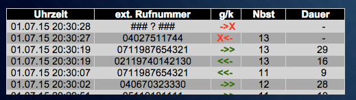
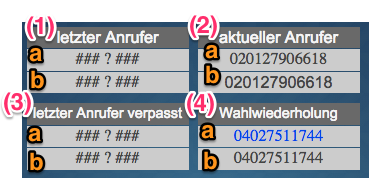

ioBroker fritzbox Adapter
===========================


[](https://www.npmjs.com/package/iobroker.fritzbox)


<!-- [](https://weblate.iobroker.net/engage/adapters/?utm_source=widget) -->
[](https://www.npmjs.com/package/iobroker.fritzbox)

**This adapter uses Sentry libraries to automatically report exceptions and code errors to the developers.** For more details and for information how to disable the error reporting see [Sentry-Plugin Documentation](https://github.com/ioBroker/plugin-sentry#plugin-sentry)! Sentry reporting is used starting with js-controller 3.0.

## Install

Choose Adapter "fritzbox" in ioBroker Admin

## Configuration

## Dokumentation der Datenpunkte

Unter **fritzbox.x.** legt der Adapter folgende Channel und Datenpunkte an:

* message                                 (Meldung aus der Fritzbox)

* **calls.                                  (CHANNEL)**
* calls.ring                              (true/false, steht ein Ruf an?)
* calls.missedCount                       (Integer, read & write, Anzahl verpasster Anrufe)
* calls.missedDateReset                   (Datum, zu dem calls.missedCount auf 0 gesetzt wurde
* calls.ringActualNumber                  (aktuell anstehender Ruf (der Letzte, wenn es mehrere gibt))
* calls.ringActualNumbers                 (alle aktuell anstehenden Rufe)
* calls.ringLastNumber                    (letzter Anrufer)
* calls.ringLastMissedNumber              (letzter verpasster Anrufer)
* calls.callLastNumber                    (Wahlwiederholung, letzte gewählte Rufnummer)
* calls.connectNumber                     (letztes aktuell verbundenes Gespräch)
* calls.connectNumbers                    (alle aktuell verbundenen Gespräche)

* **calls.counterActualCalls.               (CHANNEL - Realtime)**
* calls.counterActualCalls.ringCount      (Anzahl der anstehenden Anrufe (RING))
* calls.counterActualCalls.callCount      (Anzahl der gehenden Anrufversuche (CALL))
* calls.counterActualCalls.connectCount   (Anzahl der bestehenden Gespräche (CONNECT))
* calls.counterActualCalls.allActiveCount (Anzahl aktiver Anrufe (CALL, RING & CONNECT)

* **calls.telLinks.                         (CHANNEL - wählbare Rufnummern tel:+...)**
* calls.telLinks.ringLastNumberTel        (letzter Anrufer als wählbarer Link)
* calls.telLinks.ringLastMissedNumberTel  (letzter verpasster Anrufer als wählbarer Link)
* calls.telLinks.callLastNumberTel        (Wahlwiederholung, letzte gewählte Rufnummer, wählbar)

* **history.                                (CHANNEL)**
* history.allTableTxt                     (...)
* history.allTableHTML                    (Anruferliste als html Tabelle)
* history.allTableJSON                    (Anruferliste als JSON)
* history.missedTableHTML                 (Liste verpasste Anrufe als html)
* history.missedTableJSON                 (Liste verpasste Anrufe als JSON)

* **history.cdr.                            (CHANNEL)**
* history.cdr.json                        (CDR als JSON)
* history.cdr.html                        (CDR als html)
* history.cdr.txt                         (CDR als txt)
* history.cdr.missedJSON                  (letzter verpasster Anruf als JSON)
* history.cdr.missedHTML                  (letzte verpasster Anruf als html)

* **callmonitor.                            (CHANNEL - Realtime)**
* callmonitor.all                         (html Liste: alle aktiven Anrufe in allen Zuständen)
* callmonitor.ring                        (html Liste: alle aktiven Anrufe
* callmonitor.call                        (html Liste: alle gehenden Gespräche)
* callmonitor.connect                     (html Liste: alle verbundenen Gespräche)

* **system.                                 (CHANNEL)**
* system.deltaTime                        (Deltazeit zwischen System und Fritzbox in Sek.)
* system.deltaTimeOK                      (true/false Deltazeit zwischen System und Fritzbox in der Tolereanz)

* **wlan.                                   (CHANNEL)**
* wlan.enabled                            (true/false, read & write, Zustand des WLANs, nur verfügbar wenn Passwort konfiguriert ist)

* **phonebook.                              (CHANNEL)**
* phonebook.tableJSON                     (Telefonbuch aller externen Nummern als JSON)

* **tam.                              (CHANNEL)**
* tam.messagesJSON                     (Alle Nachrichten des Anrufbeantworters als JSON)

## Beispiel-Widgets

### Fritzbox Widget in groß

Enthält u.a.:

* beim aktuellen Anruf einen roten Balken mit der Rufnummer des Anrufers
* grafischen zeitlichen Verlauf für die Anzahl der Gespräche nach Anrufen, Rufaufbau und Gespräch
* Zähler für verpasste Anrufe mit einem Button zum zurücksetzen
* Liste der verpassten Anrufe
* Liste aller Anrufe mit farblicher Markierung (Gespräch/kein Gespräch) und der Richtung
* Zähler für: aktuell anstehende Anrufe, aktuelle Rufaufbauten für gehende Gespräche, verbundene Gespräche, Gesamtanzahl von Gesprächen/Gesprächsversuchen
* ein Infofeld, welches gelb eingeblendet wird, wenn die Fritzboxzeit von der ioBroker-Systemzeit zu stark abweicht


[ioBroker Fritzbox Widget in groß als VIS Importdatei](widgets/iobroker_fritzbox_widget_gross.json)


### Fritzbox Widget Live-Anrufmonitor

Zeigt alle aktiven Gespräche, Anrufe (klingeln) und gehende Rufaufbauten an. Bei den aktiven Gesprächen und den Anrufen wird die Dauer eingeblendet (sekündlich aktualisiert).


[ioBroker Widget Live-Anrufmonitor zum Import in VIS](widgets/iobroker_fritzbox_anrufmonitor.json)


### Fritzbox Widget Anruferliste mit dem "basic - HTML Widget"

Die Spalteninhalte und die dazugehörigen Überschriften können mit dem Widget frei gewählt werden. Damit sind auch Überschriften in anderen Sprachen möglich.



[ioBroker Widget Anruferliste mit dem basic - HTML Widget zum Import in VIS](widgets/iobroker_fritzbox_html_table.json)


### Fritzbox Widgets Informationen zum aktuellen Anrufer, sowie vergangenen Anrufern

Die Informationswidgets sind Beispiele für einzelne Datenpunkte, die der Fritzbox-Adapter generiert.

Es exestiert jeweils ein Datenpunkt mit der Rufnummer, wie sie von der Fritzbox ausgegeben wurde (a) und ein Datenpunkt mit der Rufnummer umgewandelt als wählbarer Link (b) (es wird z.B. die Rufnummer 020147114711 angezeigt und als Link mit tel:+4920147114711 versehen). Die Tel-Links machen z.B. für VIS Oberflächen auf Smartphones Sinn, um einen verpassten Anruf direkt per Fingertipp zurückrufen zu können.

Beispielwidgets:
* (1) letzter Anrufer
* (2) aktueller Anrufer (wird für die Dauer des Klingelns angezeigt)
* (3) letzter Anrufer, der verpasst (nicht angenommen wurden)
* (4) Wahlwiederholung: zuletzt gewählte Rufnummer



[ioBroker Widget Informationen zu den letzten Anrufen](widgets/iobroker_fritzbox_letzte_telefonate.json)

## JSON Datenformat für JSON CDR und JSON Anruferliste

```
{
"date":"25.07.15 16:40:21",
"dateEpoch":1437835221000,
"dateEpochNow":1437835221000,
"deltaTime":0,
"deltaTimeOK":true,
"type":"DISCONNECT",
"id":"1",
"extensionLine":"11",
"ownNumber":"021147114711",
"externalNumber":"051112345678",
"lineType":"POTS",
"durationSecs":"55",
"durationForm":"&nbsp;&nbsp;&nbsp;&nbsp;&nbsp;55",
"durationSecs2":"55",
"durationRingSecs":"",
"connect":true,
"direction":"out",
"dateStartEpoch":1437835144000,
"dateConnEpoch":1437835167000,
"dateEndEpoch":1437835221000,
"dateStart":"25.07.15 16:39:04",
"dateConn":"25.07.15 16:39:27",
"dateEnd":"25.07.15 16:40:21",
"callSymbol":"<<-&nbsp;",
"callSymbolColor":"<span style="\" color:green\""=""><b><<-&nbsp;</b></span>",
"unknownNumber":false,
"ownNumberForm":"021147114711&nbsp;&nbsp;&nbsp;",
"externalNumberForm":"051112345678&nbsp;&nbsp;&nbsp;&nbsp;&nbsp;",
"ownNumberE164":"+4921147114711",
"externalE164":"+4951112345678",
"externalTelLink":"<a style="\" text-decoration:"="" none;\"="" href="\" tel:+4951112345678\""="">051112345678&nbsp;&nbsp;&nbsp;&nbsp;&nbsp;</a>",
"externalTelLinkCenter":"<a style="\" text-decoration:"="" none;\"="" href="\" tel:+4951112345678\""="">051112345678</a>"
}
```

## todo
* Doku der Datenpunkte
* Import des xml Telefonbuch der Fritzbox
* Feinere Konfiguration der Anruferliste (Tabellen)

## Changelog

### __WORK IN PROGRESS__
* (Apollon77) Write history.missedTableJSON value
* (Apollon77) Store tam files in an instance specific location
* (Apollon77) Fix crash cases reported by Sentry

### 0.4.0 (2022-03-25)
* IMPORTANT: You need to re-enter the password once after installing this version!
* (Khaos66/Apollon77) General updates and fixes
* (Khaos66) TAM (Telephone Answering Maschine) support added
* (Apollon77) Add Sentry for crash reporting

### 0.3.1 (2016-07-24)
* (BasGo) enhanced TR-064 configuration
* (BasGo) added rudimentary phonebook download into object store

### 0.3.0 (2015-06-26)
* (UncleSamSwiss) added support for wlan.enabled (using TR-064)

### 0.2.1 (2015-06-28)
* (ruhr) more configuration options

### 0.2.0 (2015-06-26)
* (ruhr)

## License

The MIT License (MIT)

Copyright (c) 2015-2022, ruhr70

Permission is hereby granted, free of charge, to any person obtaining a copy
of this software and associated documentation files (the "Software"), to deal
in the Software without restriction, including without limitation the rights
to use, copy, modify, merge, publish, distribute, sublicense, and/or sell
copies of the Software, and to permit persons to whom the Software is
furnished to do so, subject to the following conditions:

The above copyright notice and this permission notice shall be included in
all copies or substantial portions of the Software.

THE SOFTWARE IS PROVIDED "AS IS", WITHOUT WARRANTY OF ANY KIND, EXPRESS OR
IMPLIED, INCLUDING BUT NOT LIMITED TO THE WARRANTIES OF MERCHANTABILITY,
FITNESS FOR A PARTICULAR PURPOSE AND NONINFRINGEMENT. IN NO EVENT SHALL THE
AUTHORS OR COPYRIGHT HOLDERS BE LIABLE FOR ANY CLAIM, DAMAGES OR OTHER
LIABILITY, WHETHER IN AN ACTION OF CONTRACT, TORT OR OTHERWISE, ARISING FROM,
OUT OF OR IN CONNECTION WITH THE SOFTWARE OR THE USE OR OTHER DEALINGS IN
THE SOFTWARE.
