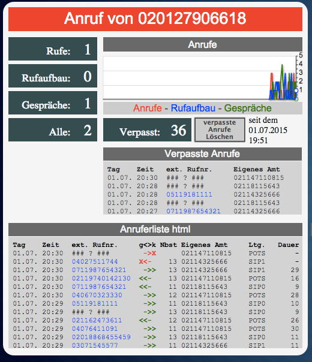
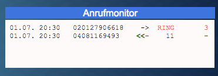

ioBroker fritzbox Adapter
===========================


## Changelog
### 0.2.1 (2015-06-28)
* (ruhr) more configuration options

### 0.2.0 (2015-06-26)
* (ruhr) 

## Install

```node iobroker.js add fritzbox```

## Configuration

## Dokumentation der Objekte

Unter **fritzbox.x.** legt der Adapter folgende Channel und Objekte an:

* message                                 (Meldung aus der Fritzbox)

* **calls.                                  (CHANNEL)**
* calls.ring                              (true/false, steht ein Ruf an?)
* calls.missedCount                       (Integer, read & write, Anzahl verpasster Anrufe)
* calls.missedDateReset                   (Datum, zu dem calls.missedCount auf 0 gesetzt wurde
* calls.ringActualNumber                  (aktuell anstehender Ruf (der Letzte, wenn es mehrere gibt))
* calls.ringActualNumbers                 (alle aktuell anstehenden Rufe)
* calls.ringLastNumber                    (letzter Anrufer)
* calls.ringLastMissedNumber              (letzter verpasster Anrufer)
* calls.callLastNumber                    (Wahlwiederholung, letzte gewählte Rufnummer)
* calls.connectNumber                     (letztes aktuell verbundenes Gespräch)
* calls.connectNumbers                    (alle aktuell verbundenen Gespräche)

* **calls.counterActualCalls.               (CHANNEL - Realtime)**
* calls.counterActualCalls.ringCount      (Anzahl der anstehenden Anrufe (RING))
* calls.counterActualCalls.callCount      (Anzahl der gehenden Anrufversuche (CALL))
* calls.counterActualCalls.connectCount   (Anzahl der bestehenden Gespräche (CONNECT))
* calls.counterActualCalls.allActiveCount (Anzahl aktiver Anrufe (CALL, RING & CONNECT)

* **calls.telLinks.                         (CHANNEL - wählbare Rufnummern tel:+...)**
* calls.telLinks.ringLastNumberTel        (letzter Anrufer als wählbarer Link)
* calls.telLinks.ringLastMissedNumberTel  (letzter verpasster Anrufer als wählbarer Link)
* calls.telLinks.callLastNumberTel        (Wahlwiederholung, letzte gewählte Rufnummer, wählbar)

* **history.                                (CHANNEL)**
* history.allTableTxt                     (...)
* history.allTableHTML                    (Anruferliste als html Tabelle)
* history.allTableJSON                    (Anruferliste als JSON)
* history.missedTableHTML                 (Liste verpasste Anrufe als html)
* history.missedTableJSON                 (Liste verpasste Anrufe als JSON)

* **history.cdr.                            (CHANNEL)**
* history.cdr.json                        (CDR als JSON)
* history.cdr.html                        (CDR als html)
* history.cdr.txt                         (CDR als txt)
* history.cdr.missedJSON                  (letzter verpasster Anruf als JSON)
* history.cdr.missedHTML                  (letzte verpasster Anruf als html)

* **callmonitor.                            (CHANNEL - Realtime)**
* callmonitor.all                         (html Liste: alle aktiven Anrufe in allen Zuständen)
* callmonitor.ring                        (html Liste: alle aktiven Anrufe
* callmonitor.call                        (html Liste: alle gehenden Gespräche)
* callmonitor.connect                     (html Liste: alle verbundenen Gespräche)

* **system.                                 (CHANNEL)**
* system.deltaTime                        (Deltazeit zwischen System und Fritzbox in Sek.)
* system.deltaTimeOK                      (true/false Deltazeit zwischen System und Fritzbox in der Tolereanz)


## Beispiel-Widgets

### Fritzbox Widget in groß

Enthält u.a.:

* beim aktuellen Anruf einen roten Balken mit der Rufnummer des Anrufers
* grafischen zeitlichen Verlauf für die Anzahl der Gespräche nach Anrufen, Rufaufbau und Gespräch
* Zähler für verpasste Anrufe mit einem Button zum zurücksetzen
* Liste der verpassten Anrufe
* Liste aller Anrufe mit farblicher Markierung (Gespräch/kein Gespräch) und der Richtung
* Zähler für: aktuell anstehende Anrufe, aktuelle Rufaufbauten für gehende Gespräche, verbundene Gespräche, Gesamtanzahl von Gesprächen/Gesprächsversuchen
* ein Infofeld, welches gelb eingeblendet wird, wenn die Fritzboxzeit von der ioBroker-Systemzeit zu stark abweicht



[ioBroker Fritzbox Widget in groß als VIS Importdatei](widgets/iobroker_fritzbox_widget_gross.json)


### Fritzbox Widget Live-Anrufmonitor




## todo
* Doku der Datenpunkte
* Import des xml Telefonbuch der Fritzbox
* Feinere Konfiguration der Anruferliste (Tabellen)

## License

The MIT License (MIT)

Copyright (c) 2015, ruhr70

Permission is hereby granted, free of charge, to any person obtaining a copy
of this software and associated documentation files (the "Software"), to deal
in the Software without restriction, including without limitation the rights
to use, copy, modify, merge, publish, distribute, sublicense, and/or sell
copies of the Software, and to permit persons to whom the Software is
furnished to do so, subject to the following conditions:

The above copyright notice and this permission notice shall be included in
all copies or substantial portions of the Software.

THE SOFTWARE IS PROVIDED "AS IS", WITHOUT WARRANTY OF ANY KIND, EXPRESS OR
IMPLIED, INCLUDING BUT NOT LIMITED TO THE WARRANTIES OF MERCHANTABILITY,
FITNESS FOR A PARTICULAR PURPOSE AND NONINFRINGEMENT. IN NO EVENT SHALL THE
AUTHORS OR COPYRIGHT HOLDERS BE LIABLE FOR ANY CLAIM, DAMAGES OR OTHER
LIABILITY, WHETHER IN AN ACTION OF CONTRACT, TORT OR OTHERWISE, ARISING FROM,
OUT OF OR IN CONNECTION WITH THE SOFTWARE OR THE USE OR OTHER DEALINGS IN
THE SOFTWARE.
