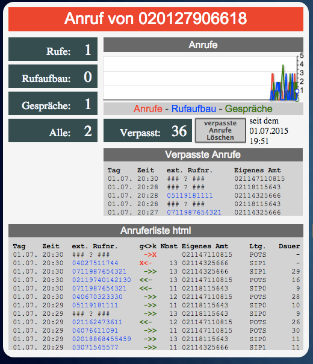
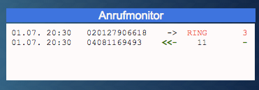
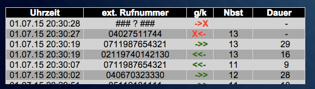
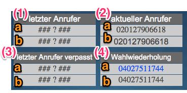

ioBroker fritzbox Adapter
===========================


[](https://www.npmjs.com/package/iobroker.fritzbox)


<!-- [](https://weblate.iobroker.net/engage/adapters/?utm_source=widget) -->
[](https://www.npmjs.com/package/iobroker.fritzbox)

**This adapter uses Sentry libraries to automatically report exceptions and code errors to the developers.** For more details and for information how to disable the error reporting see [Sentry-Plugin Documentation](https://github.com/ioBroker/plugin-sentry#plugin-sentry)! Sentry reporting is used starting with js-controller 3.0.

## Install

Choose Adapter "fritzbox" in ioBroker Admin

## Configuration

## Data Points Documentation

Under **fritzbox.x.** the adapter creates the following channels and data points:

* message                                 (Message from the FRITZ!Box)

* **calls.                                  (CHANNEL)**
* calls.ring                              (true/false, is there an incoming call?)
* calls.missedCount                       (Integer, read & write, number of missed calls)
* calls.missedDateReset                   (Date when calls.missedCount was last reset to 0)
* calls.ringActualNumber                  (currently ringing call (the last one if there are multiple))
* calls.ringActualNumbers                 (all currently ringing calls)
* calls.ringLastNumber                    (last caller)
* calls.ringLastMissedNumber              (last missed caller)
* calls.callLastNumber                    (redial, last dialed phone number)
* calls.connectNumber                     (last currently connected call)
* calls.connectNumbers                    (all currently connected calls)

* **calls.counterActualCalls.               (CHANNEL - Realtime)**
* calls.counterActualCalls.ringCount      (number of incoming ringing calls (RING))
* calls.counterActualCalls.callCount      (number of outgoing call attempts (CALL))
* calls.counterActualCalls.connectCount   (number of active connected calls (CONNECT))
* calls.counterActualCalls.allActiveCount (number of all active calls (CALL, RING & CONNECT))

* **calls.telLinks.                         (CHANNEL - dialable phone numbers tel:+...)**
* calls.telLinks.ringLastNumberTel        (last caller as a dialable link)
* calls.telLinks.ringLastMissedNumberTel  (last missed caller as a dialable link)
* calls.telLinks.callLastNumberTel        (redial, last dialed phone number, dialable)

* **history.                                (CHANNEL)**
* history.allTableTxt                     (...)
* history.allTableHTML                    (call list as HTML table)
* history.allTableJSON                    (call list as JSON)
* history.missedTableHTML                 (missed calls list as HTML)
* history.missedTableJSON                 (missed calls list as JSON)

* **history.cdr.                            (CHANNEL)**
* history.cdr.json                        (CDR as JSON)
* history.cdr.html                        (CDR as HTML)
* history.cdr.txt                         (CDR as TXT)
* history.cdr.missedJSON                  (last missed call as JSON)
* history.cdr.missedHTML                  (last missed call as HTML)

* **callmonitor.                            (CHANNEL - Realtime)**
* callmonitor.all                         (HTML list: all active calls in all states)
* callmonitor.ring                        (HTML list: all active incoming calls)
* callmonitor.call                        (HTML list: all outgoing calls)
* callmonitor.connect                     (HTML list: all connected calls)

* **system.                                 (CHANNEL)**
* system.deltaTime                        (time delta between system and FRITZ!Box in seconds)
* system.deltaTimeOK                      (true/false, time delta between system and FRITZ!Box within tolerance)

* **wlan.                                   (CHANNEL)**
* wlan.enabled                            (true/false, read & write, WLAN state, only available when password is configured)

* **phonebook.                              (CHANNEL)**
* phonebook.tableJSON                     (phone book of all external numbers as JSON)

* **tam.                              (CHANNEL)**
* tam.messagesJSON                     (all messages of the answering machine as JSON)

## Example Widgets

### FRITZ!Box Large Widget

Includes among others:

* a red bar showing the caller's phone number during an active incoming call
* graphical timeline showing the number of calls by type: ringing, call setup, and connected
* counter for missed calls with a reset button
* list of missed calls
* list of all calls with color coding (connected/not connected) and direction
* counters for: currently ringing calls, outgoing call setups, connected calls, total calls/call attempts
* an info field that turns yellow when the FRITZ!Box time deviates too much from the ioBroker system time



[ioBroker FRITZ!Box large widget as VIS import file](widgets/iobroker_fritzbox_widget_gross.json)


### FRITZ!Box Live Call Monitor Widget

Shows all active calls, incoming calls (ringing), and outgoing call setups. The duration is displayed for active calls and incoming calls (updated every second).



[ioBroker live call monitor widget for import into VIS](widgets/iobroker_fritzbox_anrufmonitor.json)


### FRITZ!Box Call List Widget using the "basic - HTML Widget"

The column contents and their headers can be freely chosen in the widget. This also allows headings in other languages.



[ioBroker call list widget with the basic - HTML widget for import into VIS](widgets/iobroker_fritzbox_html_table.json)


### FRITZ!Box Widgets: Information About Current and Past Callers

The info widgets are examples of individual data points generated by the FRITZ!Box adapter.

There is one data point with the phone number as output by the FRITZ!Box (a), and one data point with the phone number converted to a dialable link (b) (e.g. the number 020147114711 is displayed and linked with tel:+4920147114711). The tel-links are useful, for example, on VIS interfaces on smartphones, to return a missed call with a single tap.

Example widgets:
* (1) last caller
* (2) current caller (shown for the duration of ringing)
* (3) last caller who was missed (not answered)
* (4) redial: last dialed phone number



[ioBroker widget information about recent calls](widgets/iobroker_fritzbox_letzte_telefonate.json)

## JSON Data Format for JSON CDR and JSON Call List

```
{
"date":"25.07.15 16:40:21",
"dateEpoch":1437835221000,
"dateEpochNow":1437835221000,
"deltaTime":0,
"deltaTimeOK":true,
"type":"DISCONNECT",
"id":"1",
"extensionLine":"11",
"ownNumber":"021147114711",
"externalNumber":"051112345678",
"lineType":"POTS",
"durationSecs":"55",
"durationForm":"&nbsp;&nbsp;&nbsp;&nbsp;&nbsp;55",
"durationSecs2":"55",
"durationRingSecs":"",
"connect":true,
"direction":"out",
"dateStartEpoch":1437835144000,
"dateConnEpoch":1437835167000,
"dateEndEpoch":1437835221000,
"dateStart":"25.07.15 16:39:04",
"dateConn":"25.07.15 16:39:27",
"dateEnd":"25.07.15 16:40:21",
"callSymbol":"<<-&nbsp;",
"callSymbolColor":"<span style="\" color:green\""=""><b><<-&nbsp;</b></span>",
"unknownNumber":false,
"ownNumberForm":"021147114711&nbsp;&nbsp;&nbsp;",
"externalNumberForm":"051112345678&nbsp;&nbsp;&nbsp;&nbsp;&nbsp;",
"ownNumberE164":"+4921147114711",
"externalE164":"+4951112345678",
"externalTelLink":"<a style="\" text-decoration:"="" none;\"="" href="\" tel:+4951112345678\""="">051112345678&nbsp;&nbsp;&nbsp;&nbsp;&nbsp;</a>",
"externalTelLinkCenter":"<a style="\" text-decoration:"="" none;\"="" href="\" tel:+4951112345678\""="">051112345678</a>"
}
```
<!--
## todo
* Doku der Datenpunkte
* Import des xml Telefonbuch der Fritzbox
* Feinere Konfiguration der Anruferliste (Tabellen)
-->

## Changelog
<!--
    Placeholder for the next version (at the beginning of the line):
    ### **WORK IN PROGRESS**
-->
### **WORK IN PROGRESS**
- (copilot) **ENHANCED**: Translated README documentation from German to English

### 0.7.0 (2026-03-07)
- (iobroker-bot) Adapter requires node.js >= 20 now.
- (copilot) Adapter requires admin >= 7.7.22 now
- (copilot) Adapter requires js-controller >= 6.0.11 now
- (mcm1957) Dependencies have been updated

### 0.6.0 (2024-04-11)
* (mcm1957) Adapter requires node.js >=18 and js-controller >= 5 now
* (mcm1957) Dependencies have been updated

### 0.5.0 (2022-04-02)
* (Apollon77) Write history.missedTableJSON value
* (Apollon77) Store tam files in an instance specific location
* (Apollon77) Fix crash cases reported by Sentry

### 0.4.0 (2022-03-25)
* IMPORTANT: You need to re-enter the password once after installing this version!
* (Khaos66/Apollon77) General updates and fixes
* (Khaos66) TAM (Telephone Answering Maschine) support added
* (Apollon77) Add Sentry for crash reporting

### 0.3.1 (2016-07-24)
* (BasGo) enhanced TR-064 configuration
* (BasGo) added rudimentary phonebook download into object store

## License

The MIT License (MIT)

Copyright (c) 2024-2026 iobroker-community-adapters <iobroker-community-adapters@gmx.de>  
Copyright (c) 2015-2022, ruhr70

Permission is hereby granted, free of charge, to any person obtaining a copy
of this software and associated documentation files (the "Software"), to deal
in the Software without restriction, including without limitation the rights
to use, copy, modify, merge, publish, distribute, sublicense, and/or sell
copies of the Software, and to permit persons to whom the Software is
furnished to do so, subject to the following conditions:

The above copyright notice and this permission notice shall be included in
all copies or substantial portions of the Software.

THE SOFTWARE IS PROVIDED "AS IS", WITHOUT WARRANTY OF ANY KIND, EXPRESS OR
IMPLIED, INCLUDING BUT NOT LIMITED TO THE WARRANTIES OF MERCHANTABILITY,
FITNESS FOR A PARTICULAR PURPOSE AND NONINFRINGEMENT. IN NO EVENT SHALL THE
AUTHORS OR COPYRIGHT HOLDERS BE LIABLE FOR ANY CLAIM, DAMAGES OR OTHER
LIABILITY, WHETHER IN AN ACTION OF CONTRACT, TORT OR OTHERWISE, ARISING FROM,
OUT OF OR IN CONNECTION WITH THE SOFTWARE OR THE USE OR OTHER DEALINGS IN
THE SOFTWARE.
