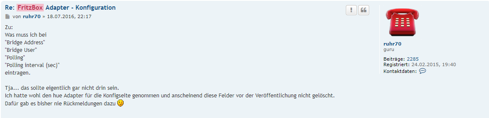
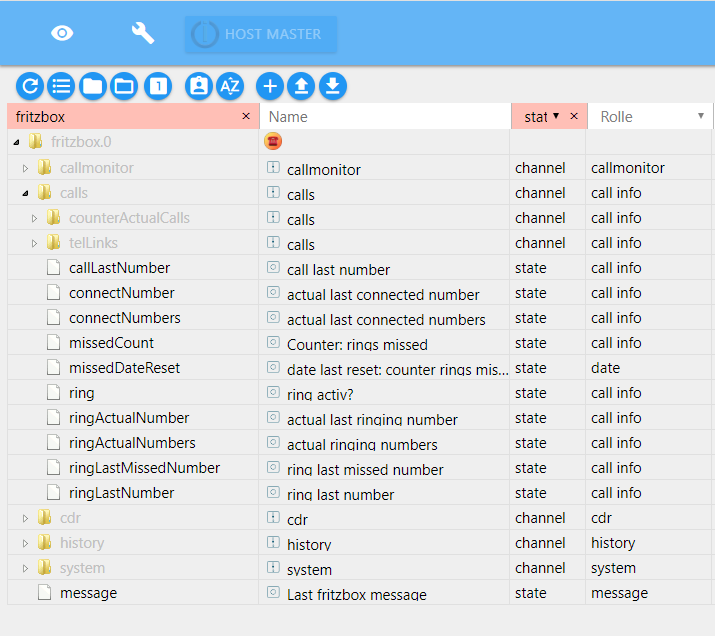
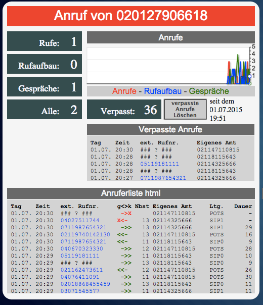
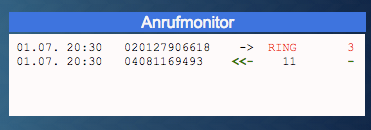
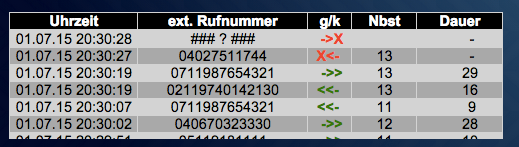

# AVM Fritz!Box®

Bei der Fritz!Box (Eigenschreibweise des Herstellers AVM) handelt es sich um die
am weitesten verbreiteten Router auf dem Markt.

Es gibt mittlerweile Modelle für alle gängigen Internet-Anschlussarten: DSL-,
Kabel-, Mobilfunk- und Glasfaserzugänge.

## Adapter Fritzbox

Der Adapter stellt eine Verbindung zwischen Fritzbox (kurz FB) und ioBroker her
und stellt Daten und Listen über Anrufe zur Verfügung.

## Voraussetzungen vor Installation

Der Datenaustausch erfolgt über den in der FB integrierten *Callmonitor*. Um
diesen zu aktivieren, ruft man von einem angeschlossenen Telefon folgende Nummer
an:

* ```\#96\*5\*``` – Callmonitor einschalten
* ```\#96\*4\*``` – Callmonitor ausschalten

## Konfiguration

### Settings

Hier ist lediglich zu aktivieren, welche Daten in welcher Form übermittelt werden sollen. Lt. Entwickler sind Datenfelder unnötig (s. Grafik und Thread im Forum); Aktualisierungen dieses Adapters entfallen, da er durch den mit mehr Möglichkeiten ausgestatteten "TR-064"-Adapter ersetzt werden kann.



Weitere Informationen im Forum [in diesem Thread](https://forum.iobroker.net/viewtopic.php?f=20&t=3344&hilit=fritzbox).

### Autosetup

sehe [Settings](#settings)

## Instanz
Unter *Instanzen* des ioBrokers finden sich die installierte Instanz des
Adapters. Links ist im Ampelsystem visualisiert, ob der Adapter aktiviert und
verbunden ist.


Platziert man den Mauszeiger auf ein Symbol, erhält man Detailinformationen.

## Objekte des Adapters

Im Bereich Objekte werden in einer Baumstruktur alle von der FB dem Adapter
übermittelten Werte, Listen und Informationen dargestellt (s. Einstellungen).

Direkt im Instanzordner *fritzbox.x* findet sich der Datenpunkt *Message* mit
Datum, Uhrzeit und Art der letzten Aktion.


Nachfolgend werden die jeweiligen Kanäle und die darin angelegten Datenpunkte
kurz beschrieben.

### Kanal callmonitor

Datenpunkte zeigen in Realtime die Anrufe

| **Datenpunkt** | **Beschreibung**                                                      |
|----------------|-----------------------------------------------------------------------|
| all            | Anzeige von Datum, Uhrzeit und Rufnummer; ein und ausgehend           |
| call           | Anzeige von Datum, Uhrzeit und Rufnummer; ausgehend                   |
| connect        | Anzeige von Datum, Uhrzeit und Rufnummer einer bestehenden Verbindung |
| ring           | Anzeige von Datum, Uhrzeit und Rufnummer ausgehender Anrufe           |

### Kanal calls

Innerhalb dieses Kanals werden 2 weitere Kanäle sowie einige Datenpunkte
angelegt:



| **Datenpunkt**       | **Beschreibung**                            |
|----------------------|---------------------------------------------|
| callLastNumber       | Zuletzt gewählte Rufnummer                  |
| connectNumber        | Letztes aktuell verbundenes Gespräch        |
| connectNumbers       | alle aktuell verbundenen Gespräche          |
| missedCount          | Zähler verpasste Anrufe                     |
| missedDateReset      | Datum letzter Zähler-Reset                  |
| ring                 | Signal eingehender Anruf                    |
| ringActualNumber     | Rufnummer eines aktuell eingehenden Anrufs  |
| RingActualNumbers    | Rufnummern aller aktuell eingehenden Anrufe |
| ringLastMissedNumber | Rufnummer letzter                           |
| ringLastNumber       | Rufnummer des letzten eingehenden Anrufs    |

#### counterActualCalls

Hier werden in Realtime die Werte der verschiedenen Zähler aktueller Anrufe
aufgeführt:

| **Datenpunkt** | **Beschreibung**                                     |
|----------------|------------------------------------------------------|
| allActiveCalls | Anzahl aller aktiven Anrufe (bestehende, eingehende) |
| callCount      | Anzahl ausgehender Anrufe                            |
| connectCount   | Anzahl bestehender Verbindungen                      |
| ringCount      | Anzahl aktuell eingehender Anrufe                    |

#### telLinks

Die unten aufgeführten Datenpunkte sind als Link formatiert, so dass die
entsprechende Nummer über den Link anwählbar ist (z.B. über ein Widget in VIS):

| **Datenpunkt**          | **Beschreibung**                             |
|-------------------------|----------------------------------------------|
| callLastNumberTel       | Letzter eingehender Anruf                    |
| ringLastMissedNumberTel | Letzter verpasster Anruf                     |
| ringLastNumberTel       | Wahlwiederholung, zuletzt gewählte Rufnummer |

### Kanal cdr

Diese Datenpunkte stellen Informationen in formatierter Form zur Verfügung (s.
Einstellungen)

| **Datenpunkt** | **Beschreibung**         |
|----------------|--------------------------|
| html           | Letzter Anruf            |
| json           |                          |
| missedHTML     | Letzter verpasster Anruf |
| missedJSON     |                          |
| txt            | Letzter Anruf            |

### Kanal history

Diese Datenpunkte stellen Tabellen formatierter Form zur Verfügung. Welche
Informationen übermittelt werden, kann in den Einstellungen festgelegt werden

| **Datenpunkt**  | **Beschreibung** |
|-----------------|------------------|
| allTableHTML    |                  |
| allTableJSON    | Alle Anrufe      |
| allTableTxt     |                  |
| missedTableHTML | Verpasste Anrufe |
| missedTablejSON |                  |

### Kanal system

| **Datenpunkt** | **Beschreibung**                                           |
|----------------|------------------------------------------------------------|
| deltaTime      | Deltazeit zwischen ioBroker-Systemzeit und Fritzbox in sec |
| deltaTimeOK    | Prüfergebnis (true/false)                                  |

## FAQ
F: Es gibt den Fritzbox- und den TR-064-Adapter, der auch auf FB-Callmonitor
zugreift. Wo sind die Unterschiede, müssen beide Adapter installiert sein?

A: Der Fritzbox-Adapter stammt aus der Anfangsphase und stellte von den
möglichen Informationen des Routers lediglich die zur Verfügung, die Anrufe
betrafen.

TR-064 kann als Weiterentwicklung betrachtet werden, da dieser Adapter viel
umfangreichere Informationen bietet, z.B. über die an der FB angemeldeten
Geräte.

Im Prinzip reicht es, wenn einer der beiden Adapter installiert ist. Da aber viele
langjährige Benutzer den FB-Adapter nutzen und darauf ihre
Visualisierung aufgebaut haben, bleibt er weiterhin verfügbar, wird aber nicht
mehr weiterentwickelt.

Neueinsteigern wird empfohlen, den [TR-064-Adapter](https://github.com/ioBroker/ioBroker.docs/tree/master/docs/adapterref/docs/iobroker.tr-064/de) zu installieren.

## Datenpunktdokumentation

Unter **fritzbox.x** erzeugt der Adapter die folgenden Kanäle und Datenpunkte:

- Nachricht (Nachricht von der FRITZ!Box)

- **Anrufe. (KANAL)**

- calls.ring (true/false, liegt ein eingehender Anruf vor?)

- calls.missedCount (Integer, read & write, Anzahl verpasster Anrufe)

- calls.missedDateReset (Datum, an dem calls.missedCount zuletzt auf 0 zurückgesetzt wurde)

- Anrufe.RingtatsächlicheNummer (derzeit klingelnder Anruf (der letzte, falls mehrere vorhanden sind))

- calls.ringActualNumbers (alle aktuell eingehenden Anrufe)

- Anrufe.RingLetzteNummer (letzter Anrufer)

- calls.ringLastMissedNumber (zuletzt verpasster Anrufer)

- Anrufe.LetzteAnrufnummer (Wahlwiederholung, zuletzt gewählte Telefonnummer)

- Anrufe.Verbindungsnummer (zuletzt verbundener Anruf)

- Anrufe.Verbindungsnummern (alle aktuell verbundenen Anrufe)

- **Anrufe.GegenaktuelleAnrufe. (KANAL - Echtzeit)**

- calls.counterActualCalls.ringCount (Anzahl eingehender Anrufe (RING))

- calls.counterActualCalls.callCount (Anzahl ausgehender Anrufversuche (CALL))

- calls.counterActualCalls.connectCount (Anzahl der aktiven verbundenen Anrufe (CONNECT))

- calls.counterActualCalls.allActiveCount (Anzahl aller aktiven Anrufe (ANRUF, KLINGELN & VERBINDUNG))

- **calls.telLinks. (CHANNEL - wählbare Telefonnummern tel:+...)**

- calls.telLinks.ringLastNumberTel (letzter Anrufer als wählbare Verbindung)

- calls.telLinks.ringLastMissedNumberTel (letzter verpasster Anrufer als wählbarer Link)

- calls.telLinks.callLastNumberTel (Wahlwiederholung, zuletzt gewählte Telefonnummer, wählbar)

- **Geschichte. (KANAL)**

- history.allTableTxt (...)

- history.allTableHTML (Aufruf der Liste als HTML-Tabelle)

- history.allTableJSON (Aufrufliste als JSON)

- history.missedTableHTML (Liste der verpassten Anrufe als HTML)

- history.missedTableJSON (Liste verpasster Anrufe als JSON)

- **history.cdr. (KANAL)**

- history.cdr.json (CDR als JSON)

- history.cdr.html (CDR als HTML)

- history.cdr.txt (CDR als TXT)

- history.cdr.missedJSON (letzter verpasster Anruf als JSON)

- history.cdr.missedHTML (letzter verpasster Anruf als HTML)

- **Anrufüberwachung. (KANAL - Echtzeit)**

- callmonitor.all (HTML-Liste: alle aktiven Anrufe in allen Status)

- callmonitor.ring (HTML-Liste: alle aktiven eingehenden Anrufe)

- callmonitor.call (HTML-Liste: alle ausgehenden Anrufe)

- callmonitor.connect (HTML-Liste: alle verbundenen Anrufe)

- **System. (KANAL)**

- system.deltaTime (Zeitdifferenz zwischen System und FRITZ!Box in Sekunden)

- system.deltaTimeOK (true/false, Zeitdifferenz zwischen System und FRITZ!Box innerhalb der Toleranz)

- **WLAN. (KANAL)**

- wlan.enabled (true/false, Lese- und Schreibzugriff, WLAN-Status, nur verfügbar, wenn ein Passwort konfiguriert ist)

- **Telefonbuch. (KANAL)**

- phonebook.tableJSON (Telefonbuch aller externen Nummern als JSON)

- **tam. (CHANNEL)**

- tam.messagesJSON (alle Nachrichten des Anrufbeantworters als JSON)


## Beispiel-Widgets

### FRITZ!Box Großes Widget

Beinhaltet unter anderem:

- Ein roter Balken, der die Telefonnummer des Anrufers während eines aktiven eingehenden Anrufs anzeigt.
- Grafische Zeitleiste mit der Anzahl der Anrufe nach Typ: Klingeln, Verbindungsaufbau und bestehende Verbindung
- Zähler für verpasste Anrufe mit Reset-Taste
- Liste der verpassten Anrufe
- Liste aller Anrufe mit Farbkennzeichnung (verbunden/nicht verbunden) und Richtung
- Zähler für: aktuell eingehende Anrufe, ausgehende Anrufaufbauten, verbundene Anrufe, Gesamtanzahl Anrufe/Anrufversuche
- Ein Infofeld, das gelb wird, wenn die FRITZ!Box-Zeit zu stark von der ioBroker-Systemzeit abweicht.



[ioBroker FRITZ!Box großes Widget als VIS-Importdatei](../../widgets/iobroker_fritzbox_widget_gross.json)

### FRITZ!Box Live-Anrufmonitor-Widget

Zeigt alle aktiven, eingehenden (klingelnden) und ausgehenden Anrufe an. Die Dauer aktiver und eingehender Anrufe wird angezeigt (Aktualisierung jede Sekunde).



[ioBroker-Widget zur Live-Anrufüberwachung für den Import in VIS](../../widgets/iobroker_fritzbox_anrufmonitor.json)

### FRITZ!Box Anruflisten-Widget mit dem "basic - HTML Widget"

Die Spalteninhalte und ihre Überschriften können im Widget frei gewählt werden. Dies ermöglicht auch Überschriften in anderen Sprachen.



[ioBroker-Anruflisten-Widget mit dem Basis-HTML-Widget zum Import in VIS](../../widgets/iobroker_fritzbox_html_table.json)

### FRITZ!Box Widgets: Informationen über aktuelle und frühere Anrufer

Die Info-Widgets sind Beispiele für einzelne Datenpunkte, die vom FRITZ!Box-Adapter generiert werden.

Es gibt einen Datenpunkt mit der von der FRITZ!Box ausgegebenen Telefonnummer (a) und einen Datenpunkt mit der in einen wählbaren Link umgewandelten Telefonnummer (b) (z. B. wird die Nummer 020147114711 angezeigt und mit tel:+4920147114711 verknüpft). Die Tel-Links sind beispielsweise auf VIS-Schnittstellen von Smartphones nützlich, um einen verpassten Anruf mit einem einzigen Tippen zurückzurufen.

Beispiel-Widgets:

- (1) letzter Anrufer
- (2) Aktueller Anrufer (wird für die Dauer des Klingelns angezeigt)
- (3) Letzter Anrufer, der nicht abgenommen wurde
- (4) Wahlwiederholung: zuletzt gewählte Telefonnummer


[ioBroker-Widget-Informationen zu den letzten Anrufen](../../widgets/iobroker_fritzbox_letzte_telefonate.json)


## JSON-Datenformat für JSON-CDR und JSON-Anrufliste
```
{
"date":"25.07.15 16:40:21",
"dateEpoch":1437835221000,
"dateEpochNow":1437835221000,
"deltaTime":0,
"deltaTimeOK":true,
"type":"DISCONNECT",
"id":"1",
"extensionLine":"11",
"ownNumber":"021147114711",
"externalNumber":"051112345678",
"lineType":"POTS",
"durationSecs":"55",
"durationForm":"&nbsp;&nbsp;&nbsp;&nbsp;&nbsp;55",
"durationSecs2":"55",
"durationRingSecs":"",
"connect":true,
"direction":"out",
"dateStartEpoch":1437835144000,
"dateConnEpoch":1437835167000,
"dateEndEpoch":1437835221000,
"dateStart":"25.07.15 16:39:04",
"dateConn":"25.07.15 16:39:27",
"dateEnd":"25.07.15 16:40:21",
"callSymbol":"<<-&nbsp;",
"callSymbolColor":"<span style="\" color:green\""=""><b><<-&nbsp;</b></span>",
"unknownNumber":false,
"ownNumberForm":"021147114711&nbsp;&nbsp;&nbsp;",
"externalNumberForm":"051112345678&nbsp;&nbsp;&nbsp;&nbsp;&nbsp;",
"ownNumberE164":"+4921147114711",
"externalE164":"+4951112345678",
"externalTelLink":"<a style="\" text-decoration:"="" none;\"="" href="\" tel:+4951112345678\""="">051112345678&nbsp;&nbsp;&nbsp;&nbsp;&nbsp;</a>",
"externalTelLinkCenter":"<a style="\" text-decoration:"="" none;\"="" href="\" tel:+4951112345678\""="">051112345678</a>"
}
```

<!--


## Changelog
<!--
    Placeholder for the next version (at the beginning of the line):
    ### **WORK IN PROGRESS**
-->
### **WORK IN PROGRESS**
- (copilot) Adapter requires node.js >= 22 now
- (copilot) **ENHANCED**: Translated README documentation from German to English

### 0.7.0 (2026-03-07)
- (iobroker-bot) Adapter requires node.js >= 20 now.
- (copilot) Adapter requires admin >= 7.7.22 now
- (copilot) Adapter requires js-controller >= 6.0.11 now
- (mcm1957) Dependencies have been updated

### 0.6.0 (2024-04-11)
* (mcm1957) Adapter requires node.js >=18 and js-controller >= 5 now
* (mcm1957) Dependencies have been updated

### 0.5.0 (2022-04-02)
* (Apollon77) Write history.missedTableJSON value
* (Apollon77) Store tam files in an instance specific location
* (Apollon77) Fix crash cases reported by Sentry

### 0.4.0 (2022-03-25)
* IMPORTANT: You need to re-enter the password once after installing this version!
* (Khaos66/Apollon77) General updates and fixes
* (Khaos66) TAM (Telephone Answering Maschine) support added
* (Apollon77) Add Sentry for crash reporting

### 0.3.1 (2016-07-24)
* (BasGo) enhanced TR-064 configuration
* (BasGo) added rudimentary phonebook download into object store

[Older changelogs can be found there](CHANGELOG_OLD.md)

## License

The MIT License (MIT)

Copyright (c) 2024-2026 iobroker-community-adapters <iobroker-community-adapters@gmx.de>  
Copyright (c) 2015-2022, ruhr70

Permission is hereby granted, free of charge, to any person obtaining a copy
of this software and associated documentation files (the "Software"), to deal
in the Software without restriction, including without limitation the rights
to use, copy, modify, merge, publish, distribute, sublicense, and/or sell
copies of the Software, and to permit persons to whom the Software is
furnished to do so, subject to the following conditions:

The above copyright notice and this permission notice shall be included in
all copies or substantial portions of the Software.

THE SOFTWARE IS PROVIDED "AS IS", WITHOUT WARRANTY OF ANY KIND, EXPRESS OR
IMPLIED, INCLUDING BUT NOT LIMITED TO THE WARRANTIES OF MERCHANTABILITY,
FITNESS FOR A PARTICULAR PURPOSE AND NONINFRINGEMENT. IN NO EVENT SHALL THE
AUTHORS OR COPYRIGHT HOLDERS BE LIABLE FOR ANY CLAIM, DAMAGES OR OTHER
LIABILITY, WHETHER IN AN ACTION OF CONTRACT, TORT OR OTHERWISE, ARISING FROM,
OUT OF OR IN CONNECTION WITH THE SOFTWARE OR THE USE OR OTHER DEALINGS IN
THE SOFTWARE.
